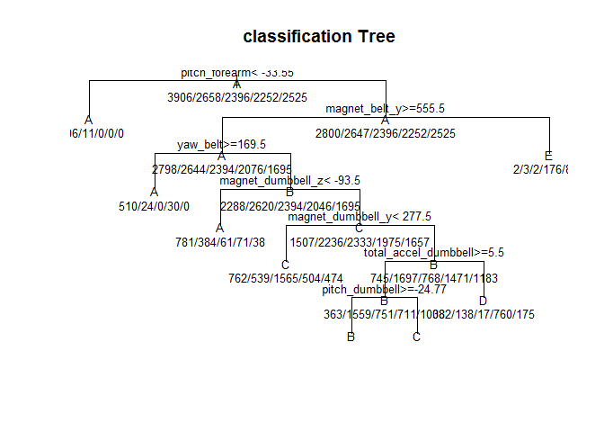
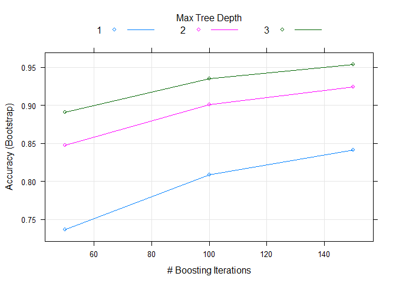

PML Modeling Project - Practical Machine Machine Learning
================

Using devices such as Jawbone Up, Nike FuelBand, and Fitbit it is now possible to collect a large amount of data about personal activity relatively inexpensively. These type of devices are part of the quantified self movement - a group of enthusiasts who take measurements about themselves regularly to improve their health, to find patterns in their behavior, or because they are tech geeks. One thing that people regularly do is quantify how much of a particular activity they do, but they rarely quantify how well they do it. In this project, the goal is to use data from accelerometers on the belt, forearm, arm, and dumbell of 6 participants. They were asked to perform barbell lifts correctly and incorrectly in 5 different ways. More information is available from the website here: \[groupware\](<http://groupware.les.inf.puc-rio.br/har> (see the section on the Weight Lifting Exercise Dataset).

The training data for this project are available here:[training set](https://d396qusza40orc.cloudfront.net/predmachlearn/pml-training.csv)

The validation data are available here:[validation set](https://d396qusza40orc.cloudfront.net/predmachlearn/pml-testing.csv)

The goal of my project is to predict 20 different validation cases. I will walk you through each step to explain how I created the model and what the results of my prediction were against the validation data set.

``` r
library(caret)
```

I first read the training data set, with translating all empty values in NA.

``` r
pmltraining<-read.csv("pml-training.csv",stringsAsFactors=FALSE,na.strings=c("","NA","NULL"))
```

I have a look at the structure of the set and found 160 columns and 19622 rows

``` r
str(pmltraining)
```

    ## 'data.frame':    19622 obs. of  160 variables:
    ##  $ X                       : int  1 2 3 4 5 6 7 8 9 10 ...
    ##  $ user_name               : chr  "carlitos" "carlitos" "carlitos" "carlitos" ...
    ##  $ raw_timestamp_part_1    : int  1323084231 1323084231 1323084231 1323084232 1323084232 1323084232 1323084232 1323084232 1323084232 1323084232 ...
    ##  $ raw_timestamp_part_2    : int  788290 808298 820366 120339 196328 304277 368296 440390 484323 484434 ...
    ##  $ cvtd_timestamp          : chr  "05/12/2011 11:23" "05/12/2011 11:23" "05/12/2011 11:23" "05/12/2011 11:23" ...
    ##  $ new_window              : chr  "no" "no" "no" "no" ...
    ##  $ num_window              : int  11 11 11 12 12 12 12 12 12 12 ...
    ##  $ roll_belt               : num  1.41 1.41 1.42 1.48 1.48 1.45 1.42 1.42 1.43 1.45 ...
    ##  $ pitch_belt              : num  8.07 8.07 8.07 8.05 8.07 8.06 8.09 8.13 8.16 8.17 ...
    ##  $ yaw_belt                : num  -94.4 -94.4 -94.4 -94.4 -94.4 -94.4 -94.4 -94.4 -94.4 -94.4 ...
    ##  $ total_accel_belt        : int  3 3 3 3 3 3 3 3 3 3 ...
    ##  $ kurtosis_roll_belt      : chr  NA NA NA NA ...
    ##  $ kurtosis_picth_belt     : chr  NA NA NA NA ...
    ##  $ kurtosis_yaw_belt       : chr  NA NA NA NA ...
    ##  $ skewness_roll_belt      : chr  NA NA NA NA ...
    ##  $ skewness_roll_belt.1    : chr  NA NA NA NA ...
    ##  $ skewness_yaw_belt       : chr  NA NA NA NA ...
    ##  $ max_roll_belt           : num  NA NA NA NA NA NA NA NA NA NA ...
    ##  $ max_picth_belt          : int  NA NA NA NA NA NA NA NA NA NA ...
    ##  $ max_yaw_belt            : chr  NA NA NA NA ...
    ##  $ min_roll_belt           : num  NA NA NA NA NA NA NA NA NA NA ...
    ##  $ min_pitch_belt          : int  NA NA NA NA NA NA NA NA NA NA ...
    ##  $ min_yaw_belt            : chr  NA NA NA NA ...
    ##  $ amplitude_roll_belt     : num  NA NA NA NA NA NA NA NA NA NA ...
    ##  $ amplitude_pitch_belt    : int  NA NA NA NA NA NA NA NA NA NA ...
    ##  $ amplitude_yaw_belt      : chr  NA NA NA NA ...
    ##  $ var_total_accel_belt    : num  NA NA NA NA NA NA NA NA NA NA ...
    ##  $ avg_roll_belt           : num  NA NA NA NA NA NA NA NA NA NA ...
    ##  $ stddev_roll_belt        : num  NA NA NA NA NA NA NA NA NA NA ...
    ##  $ var_roll_belt           : num  NA NA NA NA NA NA NA NA NA NA ...
    ##  $ avg_pitch_belt          : num  NA NA NA NA NA NA NA NA NA NA ...
    ##  $ stddev_pitch_belt       : num  NA NA NA NA NA NA NA NA NA NA ...
    ##  $ var_pitch_belt          : num  NA NA NA NA NA NA NA NA NA NA ...
    ##  $ avg_yaw_belt            : num  NA NA NA NA NA NA NA NA NA NA ...
    ##  $ stddev_yaw_belt         : num  NA NA NA NA NA NA NA NA NA NA ...
    ##  $ var_yaw_belt            : num  NA NA NA NA NA NA NA NA NA NA ...
    ##  $ gyros_belt_x            : num  0 0.02 0 0.02 0.02 0.02 0.02 0.02 0.02 0.03 ...
    ##  $ gyros_belt_y            : num  0 0 0 0 0.02 0 0 0 0 0 ...
    ##  $ gyros_belt_z            : num  -0.02 -0.02 -0.02 -0.03 -0.02 -0.02 -0.02 -0.02 -0.02 0 ...
    ##  $ accel_belt_x            : int  -21 -22 -20 -22 -21 -21 -22 -22 -20 -21 ...
    ##  $ accel_belt_y            : int  4 4 5 3 2 4 3 4 2 4 ...
    ##  $ accel_belt_z            : int  22 22 23 21 24 21 21 21 24 22 ...
    ##  $ magnet_belt_x           : int  -3 -7 -2 -6 -6 0 -4 -2 1 -3 ...
    ##  $ magnet_belt_y           : int  599 608 600 604 600 603 599 603 602 609 ...
    ##  $ magnet_belt_z           : int  -313 -311 -305 -310 -302 -312 -311 -313 -312 -308 ...
    ##  $ roll_arm                : num  -128 -128 -128 -128 -128 -128 -128 -128 -128 -128 ...
    ##  $ pitch_arm               : num  22.5 22.5 22.5 22.1 22.1 22 21.9 21.8 21.7 21.6 ...
    ##  $ yaw_arm                 : num  -161 -161 -161 -161 -161 -161 -161 -161 -161 -161 ...
    ##  $ total_accel_arm         : int  34 34 34 34 34 34 34 34 34 34 ...
    ##  $ var_accel_arm           : num  NA NA NA NA NA NA NA NA NA NA ...
    ##  $ avg_roll_arm            : num  NA NA NA NA NA NA NA NA NA NA ...
    ##  $ stddev_roll_arm         : num  NA NA NA NA NA NA NA NA NA NA ...
    ##  $ var_roll_arm            : num  NA NA NA NA NA NA NA NA NA NA ...
    ##  $ avg_pitch_arm           : num  NA NA NA NA NA NA NA NA NA NA ...
    ##  $ stddev_pitch_arm        : num  NA NA NA NA NA NA NA NA NA NA ...
    ##  $ var_pitch_arm           : num  NA NA NA NA NA NA NA NA NA NA ...
    ##  $ avg_yaw_arm             : num  NA NA NA NA NA NA NA NA NA NA ...
    ##  $ stddev_yaw_arm          : num  NA NA NA NA NA NA NA NA NA NA ...
    ##  $ var_yaw_arm             : num  NA NA NA NA NA NA NA NA NA NA ...
    ##  $ gyros_arm_x             : num  0 0.02 0.02 0.02 0 0.02 0 0.02 0.02 0.02 ...
    ##  $ gyros_arm_y             : num  0 -0.02 -0.02 -0.03 -0.03 -0.03 -0.03 -0.02 -0.03 -0.03 ...
    ##  $ gyros_arm_z             : num  -0.02 -0.02 -0.02 0.02 0 0 0 0 -0.02 -0.02 ...
    ##  $ accel_arm_x             : int  -288 -290 -289 -289 -289 -289 -289 -289 -288 -288 ...
    ##  $ accel_arm_y             : int  109 110 110 111 111 111 111 111 109 110 ...
    ##  $ accel_arm_z             : int  -123 -125 -126 -123 -123 -122 -125 -124 -122 -124 ...
    ##  $ magnet_arm_x            : int  -368 -369 -368 -372 -374 -369 -373 -372 -369 -376 ...
    ##  $ magnet_arm_y            : int  337 337 344 344 337 342 336 338 341 334 ...
    ##  $ magnet_arm_z            : int  516 513 513 512 506 513 509 510 518 516 ...
    ##  $ kurtosis_roll_arm       : chr  NA NA NA NA ...
    ##  $ kurtosis_picth_arm      : chr  NA NA NA NA ...
    ##  $ kurtosis_yaw_arm        : chr  NA NA NA NA ...
    ##  $ skewness_roll_arm       : chr  NA NA NA NA ...
    ##  $ skewness_pitch_arm      : chr  NA NA NA NA ...
    ##  $ skewness_yaw_arm        : chr  NA NA NA NA ...
    ##  $ max_roll_arm            : num  NA NA NA NA NA NA NA NA NA NA ...
    ##  $ max_picth_arm           : num  NA NA NA NA NA NA NA NA NA NA ...
    ##  $ max_yaw_arm             : int  NA NA NA NA NA NA NA NA NA NA ...
    ##  $ min_roll_arm            : num  NA NA NA NA NA NA NA NA NA NA ...
    ##  $ min_pitch_arm           : num  NA NA NA NA NA NA NA NA NA NA ...
    ##  $ min_yaw_arm             : int  NA NA NA NA NA NA NA NA NA NA ...
    ##  $ amplitude_roll_arm      : num  NA NA NA NA NA NA NA NA NA NA ...
    ##  $ amplitude_pitch_arm     : num  NA NA NA NA NA NA NA NA NA NA ...
    ##  $ amplitude_yaw_arm       : int  NA NA NA NA NA NA NA NA NA NA ...
    ##  $ roll_dumbbell           : num  13.1 13.1 12.9 13.4 13.4 ...
    ##  $ pitch_dumbbell          : num  -70.5 -70.6 -70.3 -70.4 -70.4 ...
    ##  $ yaw_dumbbell            : num  -84.9 -84.7 -85.1 -84.9 -84.9 ...
    ##  $ kurtosis_roll_dumbbell  : chr  NA NA NA NA ...
    ##  $ kurtosis_picth_dumbbell : chr  NA NA NA NA ...
    ##  $ kurtosis_yaw_dumbbell   : chr  NA NA NA NA ...
    ##  $ skewness_roll_dumbbell  : chr  NA NA NA NA ...
    ##  $ skewness_pitch_dumbbell : chr  NA NA NA NA ...
    ##  $ skewness_yaw_dumbbell   : chr  NA NA NA NA ...
    ##  $ max_roll_dumbbell       : num  NA NA NA NA NA NA NA NA NA NA ...
    ##  $ max_picth_dumbbell      : num  NA NA NA NA NA NA NA NA NA NA ...
    ##  $ max_yaw_dumbbell        : chr  NA NA NA NA ...
    ##  $ min_roll_dumbbell       : num  NA NA NA NA NA NA NA NA NA NA ...
    ##  $ min_pitch_dumbbell      : num  NA NA NA NA NA NA NA NA NA NA ...
    ##  $ min_yaw_dumbbell        : chr  NA NA NA NA ...
    ##  $ amplitude_roll_dumbbell : num  NA NA NA NA NA NA NA NA NA NA ...
    ##   [list output truncated]

I remove the columns with at least one NA value from training set. These variables are unlikely to be of any use for a prediction model.

``` r
pmltraining <- pmltraining[, colSums(is.na(pmltraining)) == 0]
```

Let's have anotherlook after NA cleanup. We now have 60 columns left.

``` r
dim(pmltraining)
```

    ## [1] 19622    60

For prediction, the first 6 variables are irrelevant, let's remove them too. Now 53 columns left

``` r
pmltraining <- pmltraining[,8:ncol(pmltraining)]
dim(pmltraining)
```

    ## [1] 19622    53

Let's now check whether we have near zero variation in some of potential predictors. We have none.

``` r
nsv<-nearZeroVar(training,saveMetrics=F)
dim(nsv)
```

    ## NULL

Now let's check whether we have highly correlated numeric variables (all int or num except column classe).

``` r
correlation <- cor(pmltraining[,-ncol(pmltraining)])
dim(correlation) # there are 52 variables
```

    ## [1] 52 52

``` r
foundcor <- findCorrelation(correlation)
str(foundcor)
```

    ##  int [1:7] 10 1 9 8 31 33 18

We have the columns number 10 1 9 8 31 33 18. Let's remove them from the set to speed up the prediction algorithm later on. We now have 46 columns left. A good cleanup from 160.

``` r
pmltraining <- pmltraining[,-foundcor]
dim(pmltraining)
```

    ## [1] 19622    46

I split the cleaned pml\_training set in a training and a testing set to keep testing\_plm.csv as validation test

``` r
inTrain<-createDataPartition(y=pmltraining$classe,p=0.70,list=F) #vector of row numbers
training <- pmltraining[inTrain,]
testing<-pmltraining[-inTrain,]
```

My first experiment is to use a regression tree

``` r
library(rpart)
set.seed(123456)
rtmodel<-train(classe ~ .,method="rpart",data=training)
varImp(rtmodel)
```

    ## rpart variable importance
    ## 
    ##   only 20 most important variables shown (out of 45)
    ## 
    ##                      Overall
    ## magnet_dumbbell_y     100.00
    ## roll_dumbbell          98.19
    ## magnet_dumbbell_x      90.78
    ## magnet_belt_y          88.36
    ## total_accel_belt       78.02
    ## gyros_belt_z           75.79
    ## pitch_forearm          57.55
    ## yaw_belt               50.89
    ## pitch_belt             42.12
    ## accel_dumbbell_y       36.07
    ## magnet_belt_z          25.49
    ## magnet_dumbbell_z      23.96
    ## pitch_dumbbell         22.04
    ## total_accel_dumbbell   22.01
    ## roll_forearm           20.94
    ## accel_dumbbell_x       18.97
    ## accel_dumbbell_z       15.42
    ## gyros_belt_y            0.00
    ## magnet_belt_x           0.00
    ## yaw_dumbbell            0.00

Then I plot it to get an overall look 

Let's now look at the accuracy and the KAPPA of the prediction. An accuracy of 0.5336 not good enough.

``` r
rtresult <- predict(rtmodel,newdata=testing)
confusionMatrix(rtresult,testing$classe)
```

    ## Confusion Matrix and Statistics
    ## 
    ##           Reference
    ## Prediction    A    B    C    D    E
    ##          A 1003  167   28   51   22
    ##          B   31  497   21  103  224
    ##          C  470  403  970  410  397
    ##          D  169   71    7  310   79
    ##          E    1    1    0   90  360
    ## 
    ## Overall Statistics
    ##                                           
    ##                Accuracy : 0.5336          
    ##                  95% CI : (0.5207, 0.5464)
    ##     No Information Rate : 0.2845          
    ##     P-Value [Acc > NIR] : < 2.2e-16       
    ##                                           
    ##                   Kappa : 0.4165          
    ##  Mcnemar's Test P-Value : < 2.2e-16       
    ## 
    ## Statistics by Class:
    ## 
    ##                      Class: A Class: B Class: C Class: D Class: E
    ## Sensitivity            0.5992  0.43635   0.9454  0.32158  0.33272
    ## Specificity            0.9364  0.92014   0.6542  0.93375  0.98085
    ## Pos Pred Value         0.7891  0.56735   0.3660  0.48742  0.79646
    ## Neg Pred Value         0.8546  0.87183   0.9827  0.87540  0.86711
    ## Prevalence             0.2845  0.19354   0.1743  0.16381  0.18386
    ## Detection Rate         0.1704  0.08445   0.1648  0.05268  0.06117
    ## Detection Prevalence   0.2160  0.14885   0.4503  0.10807  0.07681
    ## Balanced Accuracy      0.7678  0.67825   0.7998  0.62767  0.65678

My second experiment is to use a generalizerd boosted model

``` r
set.seed(123456)
gbmmodel<-train(classe ~ .,method="gbm",data=training,trControl=trainControl(),verbose=FALSE)
```

    ## Loading required package: gbm

    ## Loading required package: survival

    ## 
    ## Attaching package: 'survival'

    ## The following object is masked from 'package:caret':
    ## 
    ##     cluster

    ## Loading required package: splines

    ## Loading required package: parallel

    ## Loaded gbm 2.1.1

    ## Loading required package: plyr

``` r
print(gbmmodel$finalModel)
```

    ## A gradient boosted model with multinomial loss function.
    ## 150 iterations were performed.
    ## There were 45 predictors of which 40 had non-zero influence.

``` r
varImp(gbmmodel) # Note that the 20 most important variables are not the same
```

    ## gbm variable importance
    ## 
    ##   only 20 most important variables shown (out of 45)
    ## 
    ##                   Overall
    ## yaw_belt          100.000
    ## pitch_forearm      87.693
    ## magnet_dumbbell_z  56.961
    ## gyros_belt_z       51.543
    ## magnet_belt_y      48.878
    ## magnet_dumbbell_y  48.436
    ## magnet_belt_z      45.690
    ## roll_forearm       41.579
    ## pitch_belt         28.336
    ## roll_dumbbell      25.246
    ## total_accel_belt   24.670
    ## gyros_dumbbell_y   17.067
    ## accel_dumbbell_y   15.392
    ## accel_forearm_x    14.578
    ## yaw_arm            12.646
    ## accel_dumbbell_x   12.474
    ## magnet_forearm_z   12.463
    ## magnet_dumbbell_x  12.374
    ## accel_forearm_z    11.959
    ## magnet_arm_z        8.961

Let's plot the model  Let's see whether we have improved the accuracy of the prediction against the same testing set

``` r
gbmresult <- predict(gbmmodel,newdata=testing)
confusionMatrix(gbmresult,testing$classe)
```

    ## Confusion Matrix and Statistics
    ## 
    ##           Reference
    ## Prediction    A    B    C    D    E
    ##          A 1644   28    0    0    2
    ##          B   22 1066   32    5    5
    ##          C    4   37  972   27    6
    ##          D    4    3   21  925   11
    ##          E    0    5    1    7 1058
    ## 
    ## Overall Statistics
    ##                                           
    ##                Accuracy : 0.9626          
    ##                  95% CI : (0.9575, 0.9673)
    ##     No Information Rate : 0.2845          
    ##     P-Value [Acc > NIR] : < 2e-16         
    ##                                           
    ##                   Kappa : 0.9527          
    ##  Mcnemar's Test P-Value : 0.07908         
    ## 
    ## Statistics by Class:
    ## 
    ##                      Class: A Class: B Class: C Class: D Class: E
    ## Sensitivity            0.9821   0.9359   0.9474   0.9595   0.9778
    ## Specificity            0.9929   0.9865   0.9848   0.9921   0.9973
    ## Pos Pred Value         0.9821   0.9434   0.9293   0.9595   0.9879
    ## Neg Pred Value         0.9929   0.9846   0.9888   0.9921   0.9950
    ## Prevalence             0.2845   0.1935   0.1743   0.1638   0.1839
    ## Detection Rate         0.2794   0.1811   0.1652   0.1572   0.1798
    ## Detection Prevalence   0.2845   0.1920   0.1777   0.1638   0.1820
    ## Balanced Accuracy      0.9875   0.9612   0.9661   0.9758   0.9876

The result is an accuracy of 0.9594 and a Kappa of 0.9486. I decide to stop here to avoid overfitting of the model to the training set. I can now predict correctly in 95 % of cases.

Let's use now the validation set from testing\_plm.csv

``` r
pmlvalidation<-read.csv("pml-testing.csv",stringsAsFactors=FALSE,na.strings=c("","NA","NULL"))
result <- predict(gbmmodel,newdata=pmlvalidation)
print(result)
```

    ##  [1] B A B A A C D B A A B C B A E E A B B B
    ## Levels: A B C D E

All results are correct except for sample 6. As calculated by the model, this is a 95% accurate.
